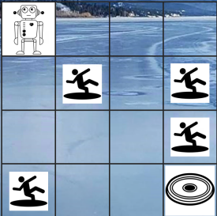

# ME 5406 project1

# Problem Statement
Consider a frozen lake with (four) holes covered by patches of very thin ice. Suppose that a robot is to glide on the frozen surface from one location(i.e., the top left corner) to another (bottom right corner) in order to pick up a frisbee, as illustrated below.

 
# 3 Model Free RL Algorithms:
1. Q learning
2. SARSA
3. First-visit Monte Carlo control

# Requirements
